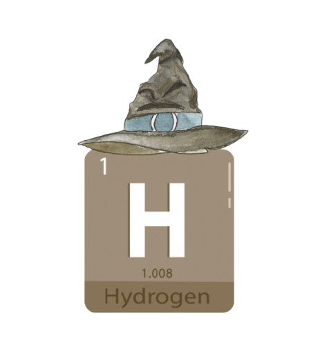
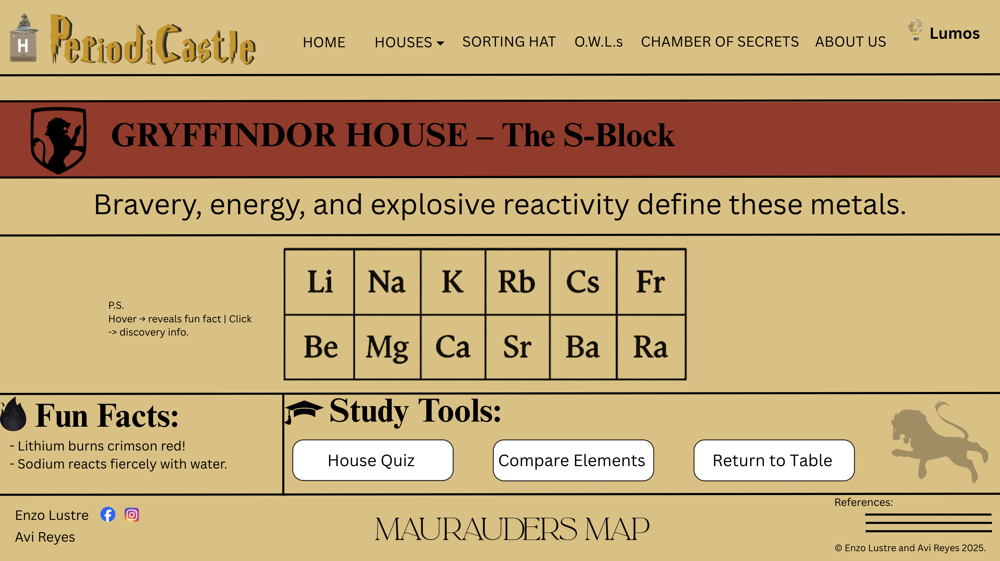

# PeriodiCastle

## Sorting Elements into The Four Houses of Chemistry

### Favicon: 

---

### Description:

PeriodiCastle is a whimsical and study-friendly website that transforms the periodic table into a Harry Potter-style design. Each element is “sorted” into one of four Houses of Chemistry — Gryffindor (s-block), Slytherin (p-block), Hufflepuff (d-block), and Ravenclaw (f-block) in order to aid students and learners in remembering the structure of the blocks, the trends, and their respective properties. Users can hover on an element to reveal information about it or even tap a sorting hat to classify an element by name, symbol, or property (e.g., electronegativity, metallic character). After learning, they may also challenge themselves in Quiz Mode.

Beyond the name, PeriodiCastle focuses on clear information propagation, accessible User Interface (UI), and modular JavaScript (JS) for search, sorting, and quizzes. Other unique features include audio toggles that let users play either the Harry Potter theme song or the Periodic Table song while studying, and a Lumos switch offering light/dark mode for comfort.

---

### Webpage Breakdown:
* **Home:** This will contain the periodic table itself which would be designed with a Harry Potter theme. Above it, there will be a short description of the website itself, while below, there will be paragraphs regarding the history of the periodic table, but presented in a “Harry Potter-like” way.
* **P1 (Gryffindor):** This part will contain all the elements that are part of the Gryffindor house (s-block). There will also be fun facts about the elements and the people known for discovering them. This would be the same for all houses.
* **P2 (Slytherin):** Similar to Gryffindor, but for Slytherin (p-block).
* **P3 (Hufflepuff):** Similar to Gryffindor, but for Hufflepuff (d-block).
* **P4 (Ravenclaw):** Similar to Gryffindor, but for Ravenclaw (f-block).
* **P5 (Sorting Hat):** This will be a search engine, wherein if you provide an element’s name, symbol, or other properties/information about the element, it will show you what house it belongs to. 
* **P6 (O.W.L.s):** O.W.L.s stands for the Ordinary Wizarding Levels which are a series of exams taken by Hogwarts students. This page can be used by students to study with various modes (Block Sort, Trends, Identify Element, and House Rapid-Fire). There’ll also be other features such as timers, scoring, streaks, and a review sheet with explanations.
* **P7 (Chamber of Secrets):** This is more of a creative page (wikipedia-like) with short articles about chemistry seen in the Harry Potter world. For instance, there could be one about acids or bases in potion analogies or one about the chemistry they used for props. 
* **P8 (Maurauder's Map):** To visually represent the site’s structure, PeriodiCastle features an interactive navigation map inspired by the Marauder’s Map. Displayed as a standalone page, it connects all major sections using circles over a parchment background. The navigation for this would be found in the footer of all pages.
* **P9 (About Us):** This will be a simple Harry Potter-themed about us page.

**Other Notes**
1. The header will contain the favicon, name of the website, navigation bar, as well as a button with a unique feature which would switch between light and dark mode. This button is labeled as "Lumos".
2. The footer will have social media links on the left, a hyperlink to the Maurauder's Map in the center, and sources and copyright notices on the right.

---

> As of now, there are two particular webpages that we are going to use JS for. Firstly would be Sorting Hat — certain inputs will cause different outputs through a decision statement. The other use for it would be for the O.W.L.s page, wherein JS script will be used for the quiz itself, as well as other unique features.

---

### Wireframe/Webpage Design:
**Home Page**

**House Pages (Gryffindor)**

**Sorting Hat**

**O.W.L.s**

**Chamber of Secrets**

**Maurauders Map**

<a href="design.html" target="_blank" rel="noopener">Open the HTML Design Page</a>
